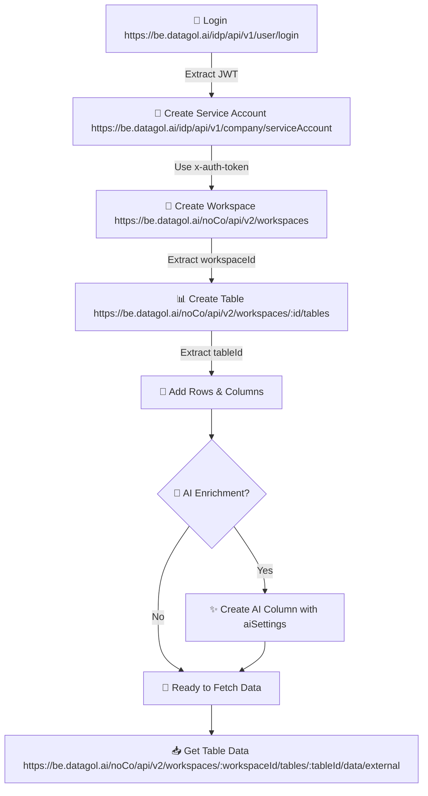

import Tabs from "@theme/Tabs";
import TabItem from "@theme/TabItem";

# 🔄 API Execution Flow

This guide outlines the standard lifecycle for building applications using the DataGOL API. By following this sequence, you can programmatically set up environments, structure data, and leverage AI enrichment without manual intervention.

## 🗺️ Visual Flowchart

The following diagram illustrates the dependency and execution order of the DataGOL API suite.



---

## 🏗️ Real-Time Example: Automated Lead Management

Imagine you are building a **CRM App** that automatically fetches leads and uses AI to categorize them based on their industry.

### Step 1: Initialize the Environment

First, ensure you have a workspace where your table will live.

**Endpoint:** `POST https://be.datagol.ai/noCo/api/v2/workspaces`  
**Goal:** Create a space called "Sales CRM".

### Step 2: Create the Leads Table

Structure your data to hold lead information.

**Endpoint:** `POST https://be.datagol.ai/noCo/api/v2/workspaces/:workspaceId/tables`  
**Request Body:**

```json
{
  "name": "Leads",
  "isIncludeColumns": true
}
```

### Step 3: Add Data and AI Enrichment

This is where the magic happens. You add columns for standard data and an AI column to summarize the lead's potential.

**Add Standard Column:**

```json
{
  "name": "company_description",
  "uiDataType": "LONG_TEXT",
  "uiMetadata": { "title": "Company Description" }
}
```

**Add AI Column (The "Super" Part):**
This API call enables AI to read the `company_description` and automatically output a "Lead Score".

```json
{
  "name": "lead_score",
  "uiDataType": "SINGLE_LINE_TEXT",
  "uiMetadata": { "title": "AI Lead Score" },
  "settings": {
    "aiSettings": {
      "enabled": true,
      "prompt": "Based on the company_description, rate this lead from 1-10",
      "model": "gpt-4o-mini"
    }
  }
}
```

### Step 4: Finalize and Fetch

Once the structure is set, you can push row data. The AI column will populate automatically.

**Access Data:**
**Endpoint:** `POST https://be.datagol.ai/noCo/api/v2/workspaces/:workspaceId/tables/:tableId/data/external`  
**Result:** You get a clean JSON response with both your manual inputs and AI-generated insights.

---

## 🤖 Machine Readability (AI-First)

If you are using **Claude Code**, **Cursor**, or any other LLM-based developer tool:

1.  **Feed the Spec**: <div><a href="/datagol-knowlegde-base-v1/openapi.yaml" download>Download the OpenAPI Spec</a></div>
2.  **Context Injection**: Tell the AI: _"I want to create a Workspace, then a Table, then an AI column. Follow the flow documented in DataGOL API Flow."_
3.  **No Manual Work**: The AI will use the spec to generate the exact cURL or Fetch commands needed for your specific language.

:::tip Pro Tip
You can enable **Web Access** in the `aiSettings` if you want the AI column to research company info from the live web!
:::
